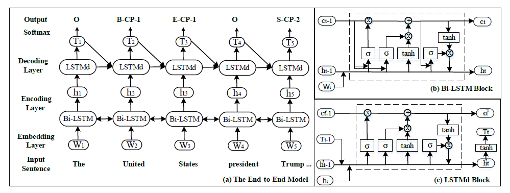

# Novel_Tagging

Joint Extraction of Entities and Relations Based on a Novel Tagging Scheme ACL 2017

### 模型结构

### 项目环境配置

* Python3.8
* jupyter notebook
* torch            1.6.0+cu10.2
* numpy            1.18.5

### 数据集下载
* 数据集下载地址： 
 https://pan.baidu.com/s/12maQjrRjv52dPcTA4dRtyw  
 提取码：bv71
* 将下载好的数据集解压并放在项目目录下
